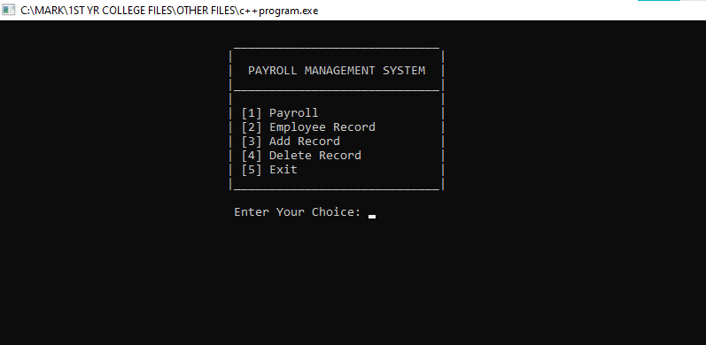
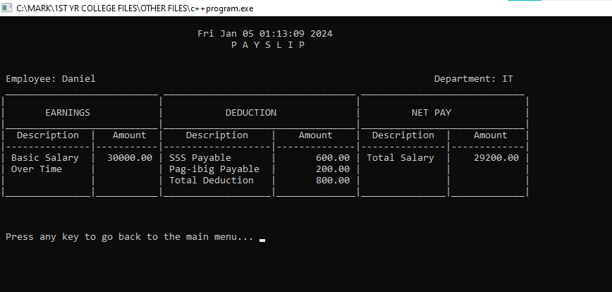

# Payroll Management System

This is a simple Payroll Management System written in C++. It allows for managing employee records, calculating payroll, adding new records, and deleting existing ones. created at Feb 2021

    
    

## Features

- **Payroll Calculation**: Calculates salary based on rate of pay and days worked.
- **Employee Record Management**: View, add, and delete employee records.

### Prerequisites

- C++ compiler (Dev-C++)

